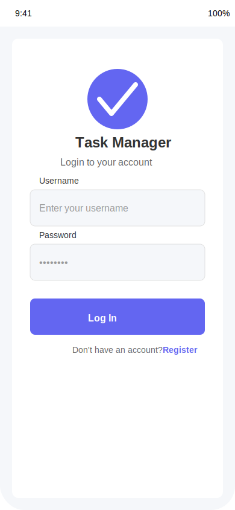
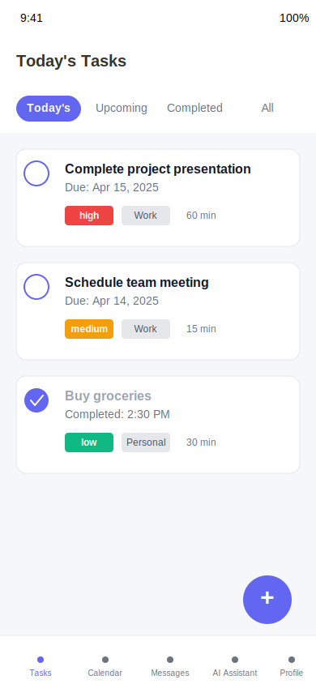
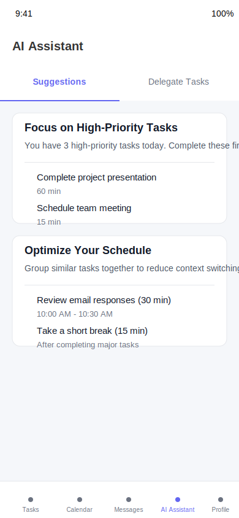

# Task Manager Mobile App Screenshots

This directory contains mockup screenshots of how the Task Manager app will look on iOS and Android devices.

## Login Screen

The login screen provides a simple, clean interface for users to authenticate to the app. It includes:
- Username and password fields
- Login button
- Registration link for new users
- App branding and logo

## Home Screen

The home screen displays the user's tasks in a clean, organized list. Features include:
- Filter tabs for Today, Upcoming, Completed, and All tasks
- Task items with priority indicators
- Completion checkboxes
- Due date information
- Floating action button to add new tasks

## AI Assistant Screen

The AI Assistant screen helps users optimize their productivity with:
- AI-generated suggestions for task management
- Task delegation capability
- Step-by-step guidance for completing complex tasks
- Estimated time indicators for each step
- Resource suggestions

## Calendar Screen

The calendar view provides:
- Monthly calendar overview
- Daily task breakdown
- Visual indicators for busy days
- Task details on selection

## Messages Screen

The messaging interface includes:
- List of recent conversations
- User avatars and status indicators
- Preview of most recent messages
- Timestamp information
- Search functionality

## Profile Screen

The profile screen displays:
- User information and statistics
- Skills and interests
- Task completion history
- Settings and preferences options

These mockups represent the expected appearance of the key screens in the mobile application. The actual implementation may vary slightly based on device-specific constraints and future design refinements.